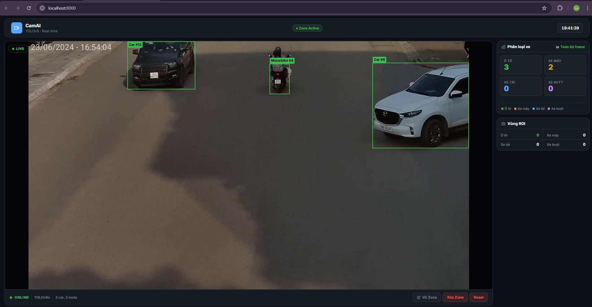
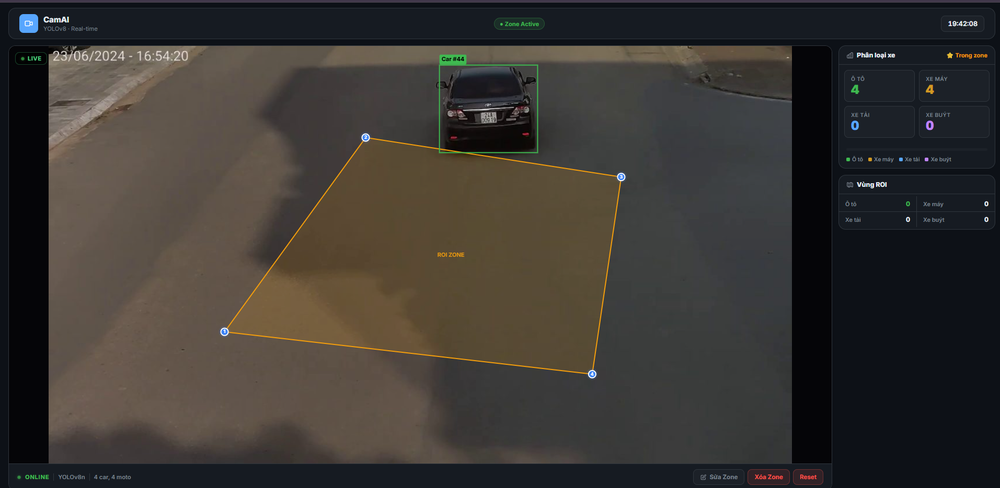
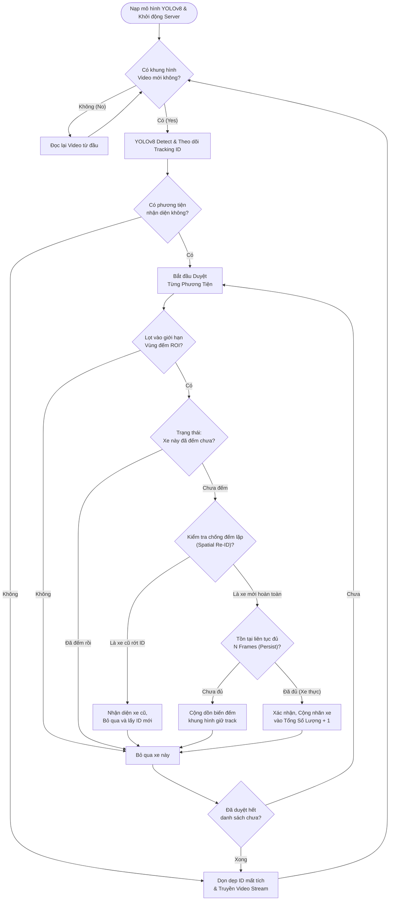

# 🚀 Hệ Thống Giám Sát và Đếm Phương Tiện Giao Thông Thông Minh (AI Vehicle Counter)

Dự án này là một hệ thống thị giác máy tính toàn diện, sử dụng trí tuệ nhân tạo để nhận diện, theo dõi và đếm các phương tiện giao thông (ô tô, xe máy, xe buýt, xe tải) theo thời gian thực. Hệ thống hỗ trợ thiết lập vùng đếm (ROI) linh hoạt và giao diện web tương tác cao.

---

## 📺 Demo Hệ Thống

| Nhận diện & Theo dõi chung | Đếm theo vùng tùy chỉnh (ROI) |
| :---: | :---: |
|  |  |
| *Hệ thống nhận diện nhiều loại xe* | *Chỉ đếm xe khi đi vào vùng đa giác* |

> [!TIP]
> **Video Demo:** Xem video demo chất lượng cao tại đây: [Link Video Demo (YouTube/Drive)](#) *(Vui lòng cập nhật link video của bạn)*

 ---


---

## 🛠 Công Nghệ Sử Dụng (Tech Stack)

*   **Backend:** Python 3.10+, FastAPI (High performance web framework).
*   **AI Engine:** Ultralytics YOLOv8 (Object Detection & Tracking).
*   **Xử lý hình ảnh:** OpenCV (cv2), NumPy.
*   **Frontend:** Vanilla JavaScript, HTML5 Canvas, CSS3 (Giao diện Dark Mode hiện đại).
*   **Communication:** WebSockets/Polling cho dữ liệu và MJPEG Streaming cho video.

---

## 📂 Cấu Trúc Thư Mục Project

```text

├── main.py              # File chạy chính, chứa luồng AI xử lý Video.
├── router.py            # Quản lý các API Endpoints và luồng Stream Video.
├── shared.py            # Chứa trạng thái dùng chung (State) và các khóa (Locks).
├── config.py            # Các cấu hình hệ thống (Model path, Video path, Class names).
├── zone.json            # Lưu trữ tọa độ vùng đếm ROI (Polygon).
├── yolov8n.pt           # Trọng số mô hình YOLOv8 Nano.
├── static/              # Thư mục chứa giao diện Web
│   ├── index.html       # Giao diện chính dashboard.
│   ├── style.css        # Định dạng thẩm mỹ cho trang web.
│   └── app.js           # Xử lý logic vẽ Canvas và gọi API phía Client.
└── test2.mp4            # Video đầu vào để test hệ thống.
```

---

## ⚡ Các Chức Năng Chính

1.  **Phân Loại Phương Tiện:** Nhận diện chính xác Car, Truck, Bus, Motorcycle.
2.  **Theo Dõi (Tracking):** Cấp ID định danh cho từng xe để không bị đếm lặp.
3.  **Vùng Đếm Tùy Chỉnh (ROI):** Cho phép người dùng vẽ vùng đa giác trực tiếp trên giao diện web để chỉ đếm xe đi qua vùng đó.
4.  **Chống Đếm Trùng (Spatial Re-ID):** Thuật toán thông minh giúp nhận diện lại xe nếu AI bị mất track trong thời gian ngắn (do bị vật cản che).
5.  **Xác Thực Frame (Persistence):** Chỉ đếm khi phương tiện xuất hiện ổn định (n frames) để loại bỏ nhiễu.
6.  **Hiệu Suất Cao:** Tách biệt luồng xử lý AI và luồng Stream Video, sử dụng Client-side Rendering để giảm tải cho CPU Server.

---

## 🔄 Luồng Xử Lý Dữ Liệu (Processing Flow)

### Sơ Đồ Thuật Toán Lõi (Core Flowchart)
Sơ đồ dưới đây mô phỏng lại logic tư duy lập trình bên trong vòng lặp AI chính (`video_loop`). Dạng sơ đồ Flowchart chuẩn này rất phù hợp để đưa vào báo cáo và slide thuyết trình:



### 1. Luồng Backend (Python)
Hệ thống chạy 2 công việc song song:
*   **Thread AI (`video_loop`):** 
    1.  Đọc Frame từ Video/Camera.
    2.  Đưa vào YOLOv8 để Detect & Track.
    3.  Lọc danh sách các ID trong vùng ROI (nếu có).
    4.  Kiểm tra điều kiện đếm (Persistence & Re-ID).
    5.  Cập nhật số liệu vào `shared.state` và lưu Frame thô vào `shared.latest_frame`.
*   **Thread Web (FastAPI):**
    1.  Cung cấp luồng ảnh `/api/stream` (MJPEG).
    2.  Trả về dữ liệu tọa độ `/api/detections` (JSON).
    3.  Nhận yêu cầu thay đổi ROI từ người dùng qua `/api/zone`.

### 2. Luồng Frontend (Browser)
1.  Hiển thị luồng Video trực tiếp từ server.
2.  Liên tục gọi API `/api/detections` để lấy tọa độ các xe hiện tại.
3.  Dùng **HTML5 Canvas** vẽ "trùm" các ô vuông (Bounding Box) và ID lên trên Video.
4.  Cập nhật biểu đồ thống kê từ `/api/stats`.

---

## 🚀 Hướng Dẫn Cài Đặt

1.  **Cài đặt thư viện:**
    ```bash
    pip install fastapi uvicorn ultralytics opencv-python numpy
    ```
2.  **Chạy ứng dụng:**
    ```bash
    python main.py
    ```
3.  **Truy cập Dashboard:** Mở trình duyệt và vào `http://localhost:8000`

---
*Tài liệu này được soạn thảo để giúp bạn nắm vững kiến trúc Multithreading và AI Integration trong Python.*
